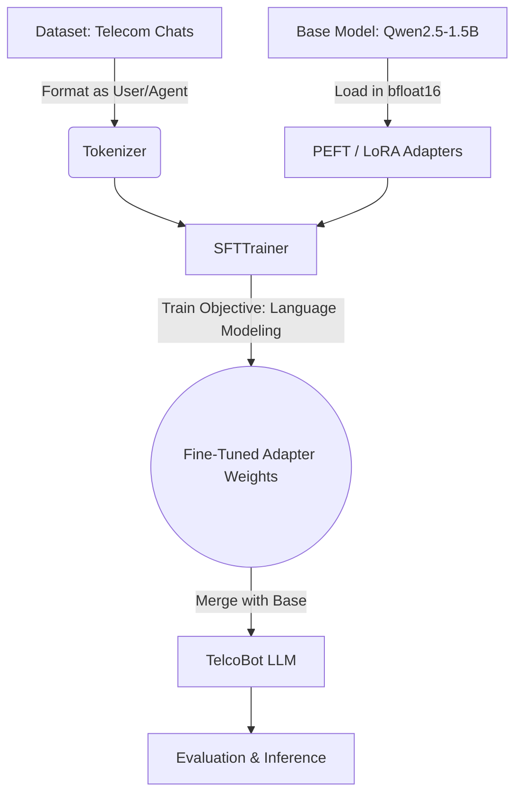

# TelcoBot-QLoRA: Telecom Support LLM Fine-Tuning

## 1. Problem Statement
Telecom customer support centers handle massive volumes of repetitive inquiries (e.g., VPN connectivity, international roaming, billing disputes, SIM replacements). Standard LLMs often fail to adopt the appropriate tone, brevity, and specific domain knowledge required for effective customer service. The goal of this project is to fine-tune a lightweight instruction model (`Qwen2.5-1.5B-Instruct`) to act as a highly capable and polite telecom customer support agent that provides concise and accurate resolutions.

---

## 📊 Results

Evaluated on **100 unseen telecom conversations** (test split):

| Metric | Base Qwen2.5-1.5B | TelecomLLM (Fine-Tuned) | Improvement |
|--------|-------------------|--------------------------|-------------|
| ROUGE-1 | 0.307 | 0.433 | **+41.0%** |
| ROUGE-2 | 0.069 | 0.171 | **+146.1%** |
| ROUGE-L | 0.156 | 0.248 | **+58.8%** |

**Training Setup:**
- Hardware: 1× AMD Instinct MI300X (192GB VRAM)
- Method: QLoRA — 4-bit NF4 quantization + LoRA adapters (r=16, α=32)
- Trainable params: 4.36M (0.28% of 1.54B base)
- Training time: 1 hour 41 minutes
- Final loss: 0.46 (from 1.61, -71% reduction)

---

## 2. Architecture Diagram



## 3. Dataset
- **Name:** `akshayjambhulkar/telecom-conversational-support-chat-pre-processed-with-agent`
- **Description:** A dataset containing real-world simulated telecom customer support chat logs between clients and support agents.
- **Format:** The raw conversations are reformatted into a chat template where the system prompts the model to handle the incoming client issues specifically as a telecom agent.

## 4. Fine-tuning Approach (QLoRA)
- **Base Model:** `Qwen/Qwen2.5-1.5B-Instruct`
- **Method:** Parameter-Efficient Fine-Tuning (PEFT) using Low-Rank Adaptation (LoRA).
- **Optimization Strategy:** To accommodate hardware constraints on the AMD Developer Cloud (ROCm) and Jupyter Notebook environments, the pipeline is optimized to load the model in native `bfloat16` precision (bypassing 4-bit quantization overhead). The training utilizes standard `DataCollatorForLanguageModeling`.

## 5. Training Parameters
To ensure training stability and strong performance within hardware constraints, the following hyperparameters are configured in `train.py`:
- **Training Samples:** 20,000
- **LoRA Rank (r):** 16
- **LoRA Alpha:** 32
- **LoRA Dropout:** 0.05
- **Target Modules:** `q_proj`, `k_proj`, `v_proj`, `o_proj`, `gate_proj`, `up_proj`, `down_proj`
- **Epochs:** 3
- **Batch Size:** 4 (Effective batch size: 8 via gradient accumulation steps of 2)
- **Max Sequence Length:** 512 tokens
- **Learning Rate:** 2e-4 (Cosine Scheduler with 0.03 warmup ratio)
- **Optimizer:** `paged_adamw_8bit`

## 6. Evaluation Metrics
Model performance is evaluated numerically using `evaluate.py`. The fine-tuned TelcoBot is evaluated against the base Qwen model across:
- **ROUGE Scores (ROUGE-1, ROUGE-2, ROUGE-L):** Measures overlap and coherence against the ground-truth agent responses in the test set.
- **Latency (Seconds):** Tracks inference speed improvements.
- **Token Count:** Evaluates the conciseness of the response (preventing overly verbose or rambling outputs).

## 7. Sample Results
During inference (`infer.py`), the model effectively solves telecom issues while strictly staying in character. 

**Scenario:** VPN Connectivity Issue
* **Input:** `client: Hi, I'm having trouble connecting to my VPN on my mobile. It worked fine yesterday but now it just times out.`
* **TelcoBot Output:** `agent: Hello! I'm sorry to hear you're experiencing trouble with your VPN connection. I can definitely help look into this for you. Are you connected to Wi-Fi or cellular data?`


## 8. How to Run

### Setup Environment
1. **PyTorch & ROCm:** If you are running on AMD AI Notebooks, PyTorch and ROCm are pre-installed, so no manual installation is necessary. If running locally, install a ROCm-compatible PyTorch (e.g., ROCm 6.2 or 7.0).
2. Install standard dependencies:
   ```bash
   pip install -r requirements.txt
   ```
3. Set up your Hugging Face Token:
   ```bash
   cp .env.example .env
   ```
   *Open `.env` and paste your `HF_TOKEN`.*

### Execution
- **Train the Model:** 
  ```bash
  python train.py
  ```
  *Saves LoRA adapters to `./outputs/`.*

- **Evaluate the Model (Metrics):** 
  ```bash
  python evaluate.py
  ```

- **Test Inference (Interactive):** 
  ```bash
  python infer.py
  ```
